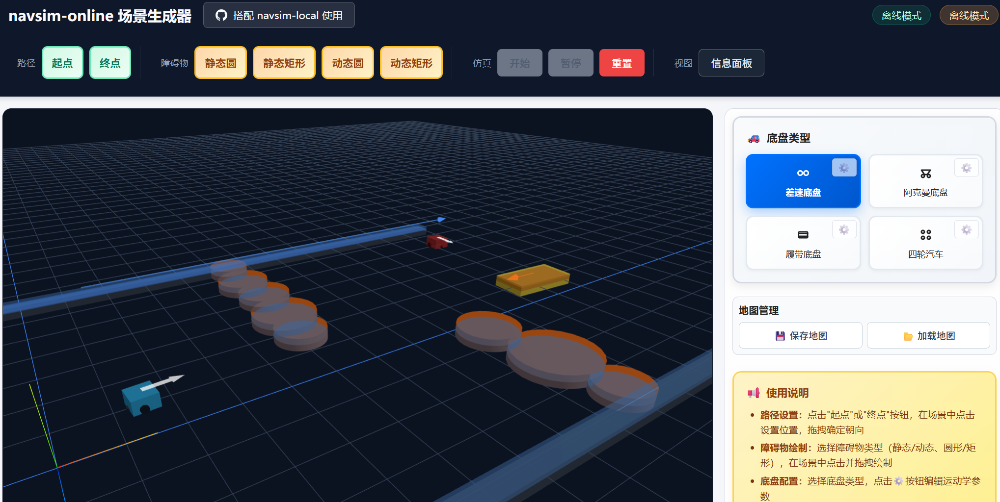
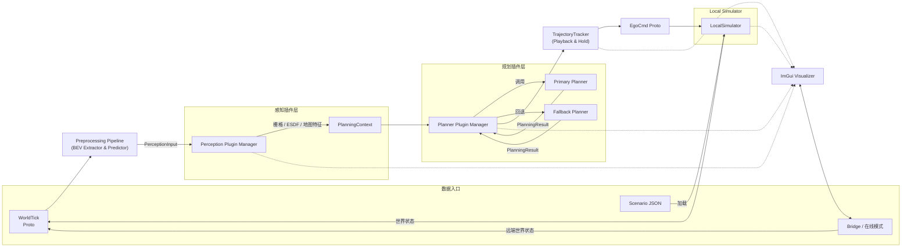
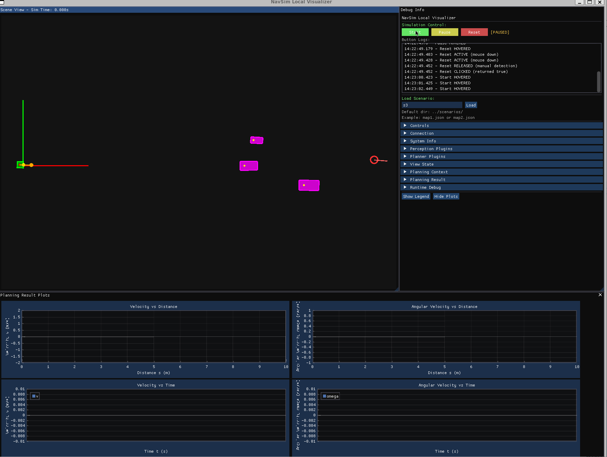
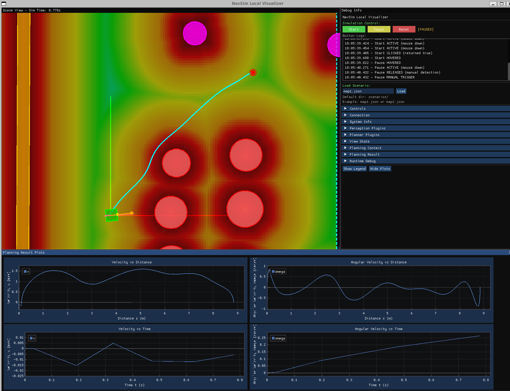
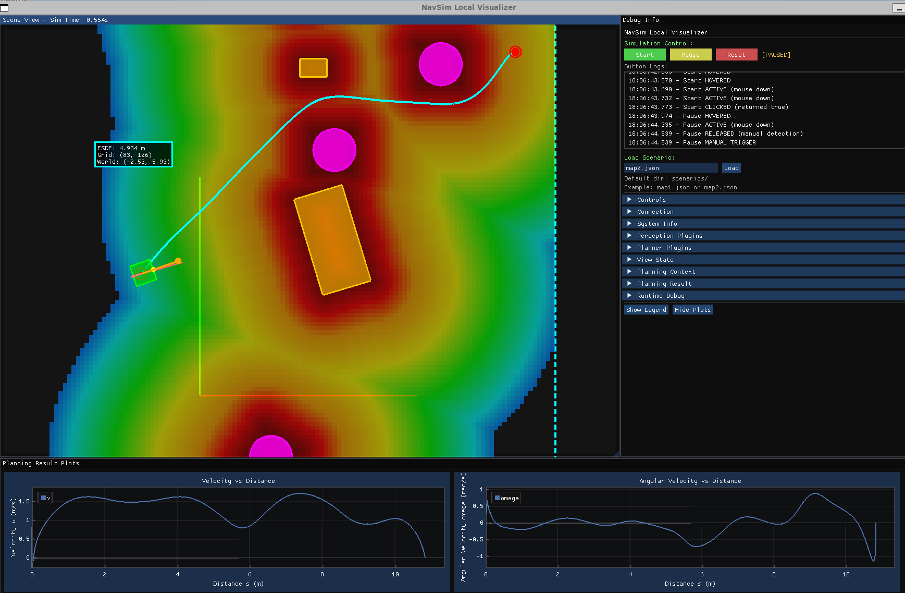
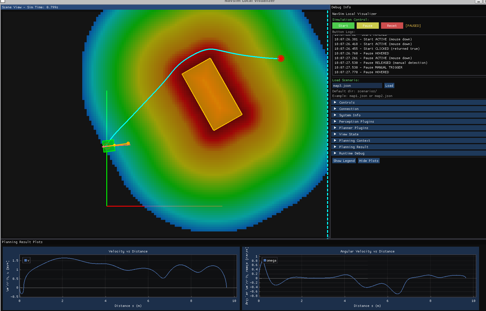
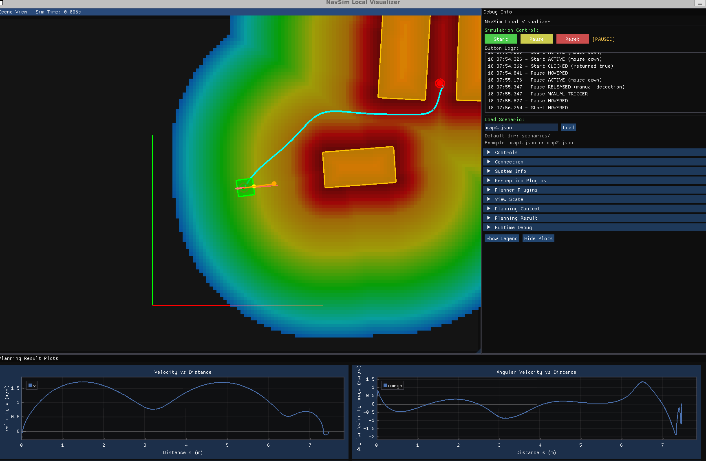
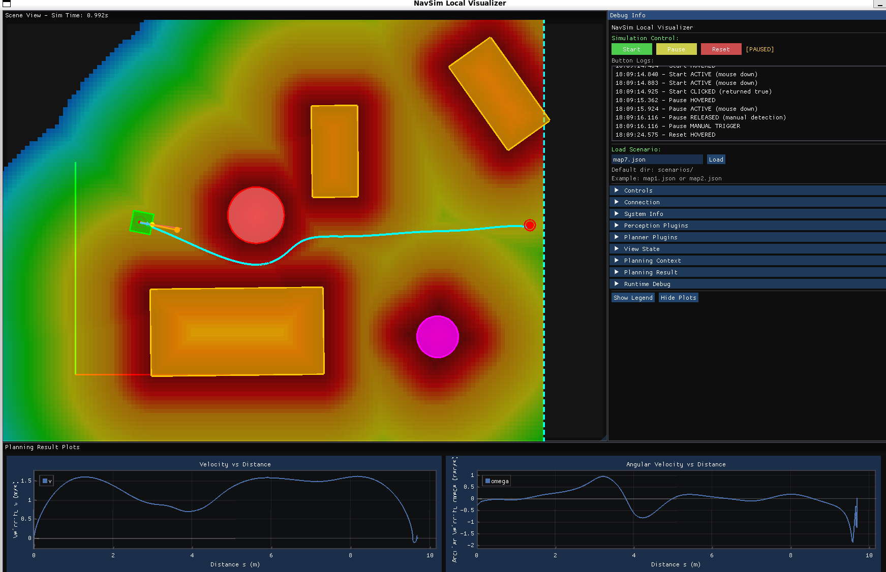
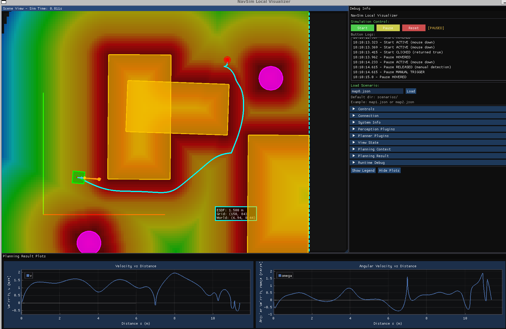
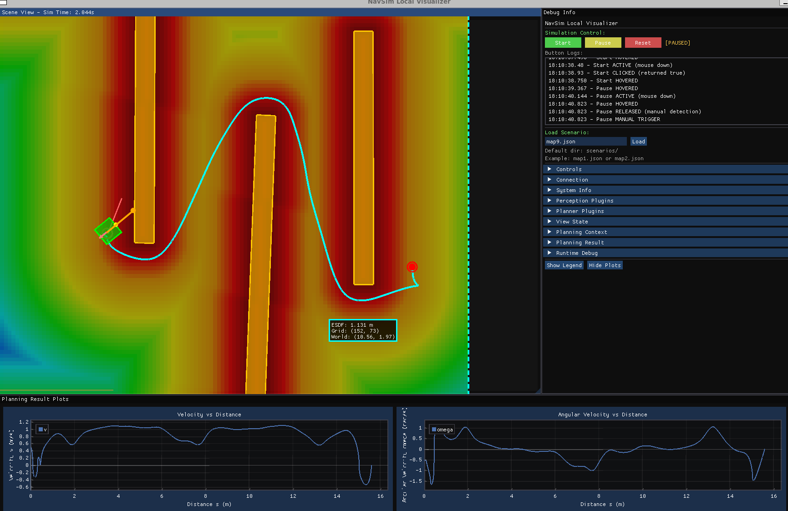

# NavSim Local


> 想马上运行起来？参考[快速上手指南](docs/quick-start.md)。

NavSim Local 是一个面向自动驾驶/移动机器人规划算法研发的“全内环”（perception → planning → control）沙箱平台。它在单进程(便于前期开发，之后版本可能改为多进程)内同时运行仿真器、感知与规划插件框架以及 ImGui/SDL2 可视化前端。项目以插件化设计为核心，开发者可以自由替换或扩展各个阶段的算法组件。

在线场景编辑器：[地址](https://www.gl-robotics.com/navsim-online/index.html)



本地仿真：


---

## 核心特性

- **模块化架构**：独立的预处理流水线、感知插件管理器和规划插件管理器由 `AlgorithmManager` 统一调度。
- **插件首位**：所有感知/规划能力均由插件实现，可在运行时动态加载或静态编译。
- **本地仿真**：内置 `LocalSimulator` 支持 JSON 场景回放、动态障碍物积分、碰撞检测与控制指令回传。
- **可视化调试**：ImGui 控制台实时展示 BEV 障碍物、轨迹、仿真状态与性能统计。
- **双运行模式(todo)**：既可离线加载场景运行，也能通过 WebSocket 与 `navsim-online` 协同。

## 规划器插件社区

当前两个插件：
- 差分驱动的轨迹优化插件DDR-opt
- 拓扑驱动mpc(t-mpc)
  
新插件会在公众号里写文章预告。

---

## 架构总览

### 简明框图


---



核心 orchestrator `AlgorithmManager` 负责：

- 初始化并管理插件系统、预处理流水线、轨迹跟踪器和可视化器；
- 划分感知/规划时间预算、统计性能指标、处理失败重试；
- 与 `LocalSimulator` 或外部 Bridge 交互并维持仿真循环；
- 在接近目标点时复用“Hold Trajectory”，避免终点附近抖动。

主要子系统说明：

- **数据入口**：场景文件、在线 Bridge 与 LocalSimulator 都能提供 `WorldTick`；
- **Preprocessing Pipeline**：规范化世界状态，输出标准 `PerceptionInput`；
- **感知插件层**：按优先级构建栅格、ESDF 等地图，在 `PlanningContext` 中汇总；
- **规划插件层**：`PlannerPluginManager` 动态选择主/备规划器，遵循时间预算；
- **TrajectoryTracker**：裁剪与缓冲轨迹，维护 hold 逻辑并输出 `EgoCmd`；
- **Visualizer & Bridge**：同步感知/规划结果，用于本地调试或在线联机。


## 插件系统

### 管理器

| 组件 | 作用 |
|------|------|
| `PerceptionPluginManager` | 根据优先级执行已启用的感知插件，把产物写入 `PlanningContext` |
| `PlannerPluginManager` | 选择主/备规划插件执行规划，可在失败时回退到备用 |

插件通过 `plugin::PluginRegistry` 注册，可静态链接也可动态加载 (`DynamicPluginLoader` 会从 `./build/plugins`、`./plugins` 中查找)。插件接口位于 `platform/include/plugin/framework`：

- `PerceptionPluginInterface`：接收 `PerceptionInput`、输出地图/障碍物等到 `PlanningContext`。
- `PlannerPluginInterface`：读取 `PlanningContext`，在给定时间预算内计算轨迹，生成 `PlanningResult`。

### 预置插件

**感知**
- `GridMapBuilder`：构建可配置栅格地图（分辨率、膨胀半径等）。
- `EsdfBuilder`：基于 occupancy grid 生成 ESDF，可选择是否包含动态障碍物。

**规划**
- `StraightLinePlanner`：自车几何直线规划，配合梯形速度曲线，作为极简 fallback。
- `AstarPlanner（不可用）`：基于网格的 A* 搜索，支持权重调节。
- `JpsPlanner`：跳点搜索 + 轨迹优化（LBFGS），具备大量优化参数可调。

所有内建插件默认构建为 `navsim_builtin_plugins` 并与核心静态库链接。

### 配置方式

运行时配置位于 `config/default.json`（或自定义文件）：

---

## 仿真引擎

### LocalSimulator

位于 `platform/src/sim/local_simulator.cpp`，职责包括：

- 加载 JSON 场景 (`scenarios/*.json`) 并转化为 `WorldState`；
- 按设定的时间步 (`SimulatorConfig.time_step`) 积分动态障碍物与自车运动；
- 执行碰撞检测（自车简化为圆形模型）并触发回调；
- 支持暂停/恢复/重置，记录实时倍率与统计信息；
- 通过回调将 `WorldTick` 发送给 `AlgorithmManager`。

场景文件包含起终点、静态/动态障碍物、容差等信息，可直接编辑或生成。

### 轨迹追踪与 Goal Hold

`control::TrajectoryTracker` 基于规划结果计算跟踪策略（lookahead 时间/距离可调），并管理“hold trajectory”，在自车接近目标（距离 ≤ `goal_hold_distance`）时复用上一条轨迹，减少终点振荡。

当前为了最真实的反应出规划器的轨迹，默认采用PLAYBACK模式，即单纯回放轨迹，没有采用复杂的跟踪算法。

### 可视化

`viz::ImGuiVisualizer`（SDL2 后端）负责：

- 绘制 BEV 障碍物、ESDF、轨迹、动态障碍物、系统信息。
- 管理仿真控制（开始/暂停/重置）并展示连接状态。
- 若初始化失败，会自动降级为 `NullVisualizer`，并在日志中给出提示。

---

## 构建指南

### 环境依赖

- CMake ≥ 3.16
- C++17 编译器（GCC / Clang）
- Protobuf 编译器与库
- SDL2 开发包（Linux: `sudo apt-get install libsdl2-dev`; macOS: `brew install sdl2`）
- ImGui + ImPlot（脚本会自动下载到 `third_party`，若不存在）
- ixwebsocket（已包含于 `third_party/ixwebsocket`）
- Eigen3（系统安装或使用 `third_party/eigen` 兜底）
- nlohmann/json（header-only，已包含）

### 一键脚本

提供三个运行脚本：

- `build_and_run_debug.sh`：单帧静态规划，默认使用esdf插件和jps插件(ddr-opt)， ./build_and_run_debug.sh
- `run_tmpc_test.sh`：单帧静态规划，默认使用拓扑MPC规划插件(t-mpc), ./run_tmpc_test.sh
- `build.sh`：动态仿真脚本，使用时执行 ./build.sh local 
---


## 结果展示：拓扑驱动mpc插件

<video controls src="docs/assets/tmpc效果展示.mp4" title="Title"></video>

 


## 结果展示：ddr-opt插件

### map1

感觉不够平滑



### map2

起步倒车了，这个ddr-opt的特性，老是喜欢倒车



### map3

起步先倒车了



### map4

轨迹不平滑，且起点有倒车，这个倒车是个问题，起步老是喜欢先倒车



### map6

看速度曲线，起点有倒车，这个没必要，单纯自转就行了


### map7

这个轨迹不平滑啊，估计是哪项权重太大了



### map8

这个轨迹看着不怎么好，终点附近不够平滑，感觉是受障碍物影响比较大


### map9 

起点附近有多余的倒车，不是很合理



## License

本项目依据 GNU General Public License v3.0（GPL-3.0）授权发布，详见仓库根目录的 `LICENSE`。

## Citing

如果你的工作基于此项目，尤其是在使用 JPS 规划器插件时引用了相关算法实现，请参考以下文献：

```bibtex
@ARTICLE{zhang2024universaltrajectoryoptimizationframework,
  author={Zhang, Mengke and Chen, Nanhe and Wang, Hu and Qiu, Jianxiong and Han, Zhichao and Ren, Qiuyu and Xu, Chao and Gao, Fei and Cao, Yanjun},
  journal={IEEE Transactions on Automation Science and Engineering},
  title={Universal Trajectory Optimization Framework for Differential Drive Robot Class},
  year={2025},
  volume={22},
  number={},
  pages={13030-13045},
  keywords={Robots;Mobile robots;Kinematics;Trajectory optimization;Planning;Robot kinematics;Computational modeling;Dynamics;Wheels;Tracking;Motion planning;trajectory optimization;differential drive robot class;nonholonomic dynamics},
  doi={10.1109/TASE.2025.3550676}
}
```

```
[2] Journal Paper: O. de Groot, L. Ferranti, D. M. Gavrila, and J. Alonso-Mora, Topology-Driven Parallel Trajectory Optimization in Dynamic Environments. IEEE Transactions on Robotics (T-RO) 2024. Available: https://doi.org/10.1109/TRO.2024.3475047

```

**更多开发细节，可关注公众号了解： 哎嗨人生**


[](https://star-history.com/#ahrs365/navsim-local&Date)
